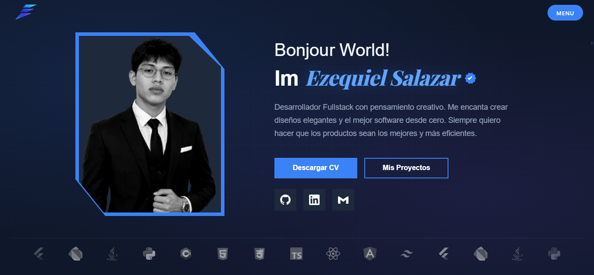
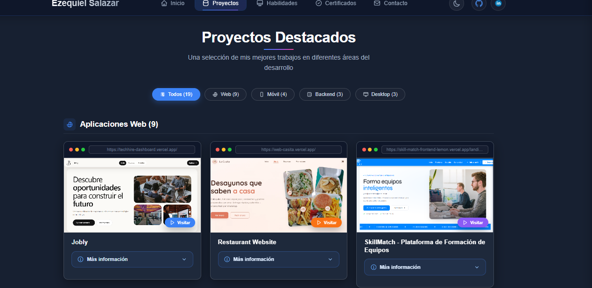
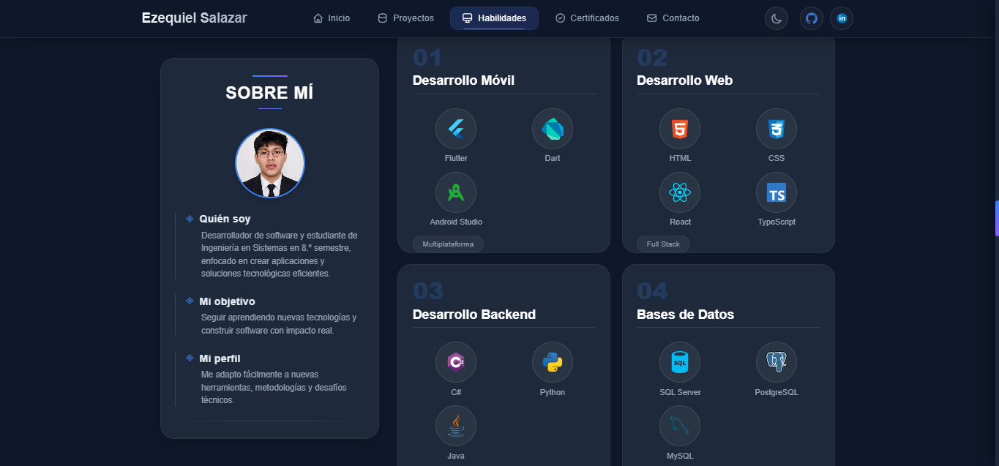
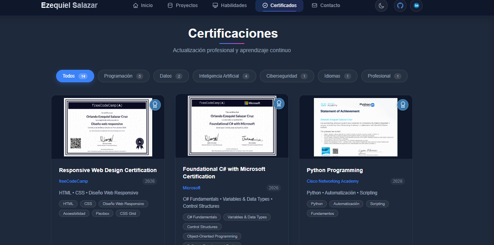

<div align="center">
  <h1>
    <svg width="40" height="40" viewBox="0 0 24 24" fill="none" stroke="currentColor" stroke-width="2" stroke-linecap="round" stroke-linejoin="round" style="vertical-align: middle; margin-right: 10px;">
      <path d="M20 7h-4V5a2 2 0 0 0-2-2h-4a2 2 0 0 0-2 2v2H4a2 2 0 0 0-2 2v9a2 2 0 0 0 2 2h16a2 2 0 0 0 2-2V9a2 2 0 0 0-2-2z"/>
      <path d="M8 7V5h8v2"/>
    </svg>
    Portafolio Web
  </h1>
  <p>Portafolio profesional con React y TypeScript</p>
  
  <div>
    
    
    
    
  </div>

  <br />
  
  
  
  <br />
  
  <div>
    <a href="https://portafolio-phi-six-35.vercel.app/">
      
    </a>
    <a href="https://github.com/Ezequie1Sc/Portafolio">
      
    </a>
  </div>
</div>

---

## 🚀 Tecnologías utilizadas

<div align="center">
  <table>
    <tr>
      <td align="center" width="120">
        <br/>
        <b>React</b>
      </td>
      <td align="center" width="120">
        <br/>
        <b>TypeScript</b>
      </td>
      <td align="center" width="120">
        <br/>
        <b>CSS3</b>
      </td>
    </tr>
  </table>
</div>

---

## 🎯 El problema

> **Desarrolladores necesitan destacar profesionalmente con un portafolio moderno.**

Sin un portafolio profesional, los desarrolladores enfrentan:

- ❌ **Dificultad para mostrar proyectos y habilidades.**
- ❌ **Falta de presencia digital atractiva.**
- ❌ **Proceso tedioso para reclutadores al evaluar candidatos.**
- ❌ **Imagen poco profesional frente a clientes potenciales.**

---

## 💡 La solución

**Portafolio con arquitectura limpia y animaciones suaves.**

- ✅ **Diseño moderno y responsive.**
- ✅ **Componentes reutilizables con TypeScript.**
- ✅ **Animaciones fluidas y transiciones.**
- ✅ **Código limpio y mantenible.**

---

## ⚙️ ¿Cómo funciona?

| Paso | Descripción |
|------|-------------|
| 1️⃣ | **Componentes reutilizables con TypeScript** - Arquitectura modular con tipado estático. |
| 2️⃣ | **Galería interactiva con filtros** - Proyectos organizados por categorías y tecnologías. |
| 3️⃣ | **Sección de habilidades con tarjetas** - Visualización clara de stacks tecnológicos. |
| 4️⃣ | **Formulario de contacto funcional** - Integración con servicio de emails. |

---

## 📊 Impacto real

> 🎯 **Mejoró la presentación de mis proyectos y facilitó la evaluación técnica por reclutadores.**

El portafolio permitió:

- ✅ **Mayor profesionalismo en búsquedas laborales.**
- ✅ **Reducción del tiempo de evaluación por reclutadores.**
- ✅ **Visualización clara de habilidades y proyectos.**
- ✅ **Feedback positivo de entrevistadores técnicos.**

---

## 🖼️ Galería

<div align="center">
  
  
  
</div>

---

## 🛠️ Instalación y uso local

### Requisitos previos

- Node.js 18+
- npm o yarn

### Instalación

```bash
# Clonar el repositorio
git clone https://github.com/ezequieldevsc/Portafolio
cd Portafolio

# Instalar dependencias
npm install
# o
yarn install

# Iniciar servidor de desarrollo
npm run dev
# o
yarn dev

# Abrir http://localhost:5173 en tu navegador