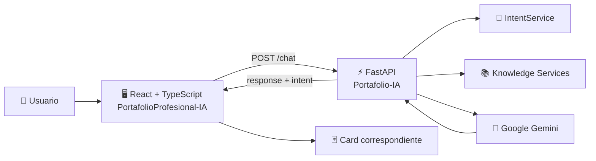
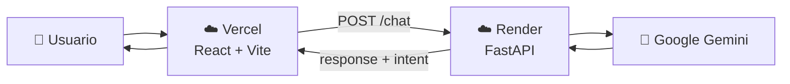

<div align="center">

# Portafolio Profesional con IA Integrado.

### Portafolio profesional interactivo construido con React + TypeScript

<p>
  
  
  
  
  
</p>

<p>
  <strong>Frontend del sistema de Portafolio IA</strong>
</p>

<p>
  Una experiencia web moderna para presentar perfil profesional, proyectos,
  habilidades, certificaciones y un asistente de IA conectado a un backend FastAPI.
</p>

<br />

<a href="https://ezequieel-dev.vercel.app/">
  
</a>

<a href="https://github.com/Ezequie1Sc/PortafolioProfesional-IA">
  
</a>

<a href="https://portafolio-ia-4r2q.onrender.com/docs">
  
</a>

</div>

---

# 🖼️ Vista general

```text

```

---

# 📌 ¿Qué es este proyecto?

**PortafolioProfesional-IA** es el frontend del sistema de portafolio profesional con inteligencia artificial.

Está desarrollado con **React + TypeScript** y está diseñado para presentar la información profesional de forma visual, modular y responsive.

Una de las características principales es el **Asistente IA**, que se comunica con una API desarrollada con **FastAPI** y utiliza **Google Gemini** para responder preguntas relacionadas con el perfil profesional.

El frontend recibe no solamente el texto generado por la IA, sino también la **intención (`intent`)** detectada por el backend.

Esto permite transformar una respuesta de texto en una experiencia visual dinámica.

---

# ✨ Características

- 🤖 Asistente IA integrado.
- 🧠 Comunicación con backend FastAPI.
- ✨ Respuestas generadas mediante Google Gemini.
- 🎯 Sistema de intents para determinar qué información mostrar.
- 🃏 Cards dinámicas para información especializada.
- 👤 Perfil profesional.
- 💻 Perfil de GitHub.
- 🛠️ Skills y tecnologías.
- 🚀 Proyectos.
- 📜 Certificaciones.
- 🎓 Educación.
- 💼 Experiencia.
- 📞 Información de contacto.
- 💬 Chat con mensajes de usuario y asistente.
- ⌨️ Indicador de escritura mientras responde la IA.
- 🔄 Limpiar conversación.
- 🎙️ Interfaz preparada para interacción por voz.
- 📜 Renderizado de Markdown en las respuestas.
- 📱 Diseño responsive.
- 🎨 Interfaz moderna con fondo y componentes personalizados.
- ⚡ Construido con Vite.
- ☁️ Desplegado en Vercel.

---

# 🧠 Arquitectura del sistema

El frontend forma parte de una arquitectura separada en dos aplicaciones:



---

# 🔄 Flujo del Asistente IA

Cuando el usuario escribe una pregunta en el chat, el flujo es:

```text
1. Usuario escribe una pregunta
             ↓
2. useChat.ts
             ↓
3. chatService.sendMessage()
             ↓
4. Axios realiza POST /chat
             ↓
5. FastAPI recibe ChatRequest
             ↓
6. ChatService detecta la intención
             ↓
7. Se consulta la información correspondiente
             ↓
8. ContextBuilder construye el contexto
             ↓
9. Gemini genera la respuesta
             ↓
10. FastAPI devuelve:
       {
         response,
         intent
       }
             ↓
11. useChat guarda el mensaje
             ↓
12. MessageRenderer analiza intent
             ↓
13. Se muestra la Card correspondiente
```

---

# 🔌 Comunicación Frontend → Backend

El frontend utiliza un servicio HTTP basado en **Axios**.

La comunicación principal utiliza:

```http
POST /chat
```

Request:

```json
{
  "message": "¿Cuáles son mis certificaciones?"
}
```

Response:

```json
{
  "response": "📜 Estas son algunas de mis certificaciones...",
  "intent": "certification"
}
```

El campo más importante para la interfaz es:

```json
"intent": "certification"
```

porque permite al frontend saber qué componente visual debe mostrar.

---

# 🃏 Sistema de Cards

El asistente no muestra toda la información únicamente como texto.

El backend devuelve una intención y el frontend la transforma en un componente visual.

La relación actual es:

| Intent | Componente |
|---|---|
| `profile` | `ProfileCard` |
| `github` | `GithubCard` |
| `skill` | `SkillsCard` |
| `project` | `ProjectCard` |
| `certification` | `CertificationCard` |

Ejemplo:

```text
Usuario:
"¿Qué tecnologías utilizas?"

        ↓

Backend:

{
  "response": "🚀 Estas son las tecnologías...",
  "intent": "skill"
}

        ↓

Frontend:

MessageRenderer

        ↓

SkillsCard
```

Esto mantiene separadas las responsabilidades:

```text
Backend
→ información + inteligencia + intent

Frontend
→ interfaz + experiencia + representación visual
```

---

# 🧩 Componentes principales del Chat

## `useChat.ts`

Es el hook encargado de controlar el estado de la conversación.

Gestiona:

- Mensajes.
- Loading.
- Errores.
- Envío de preguntas.
- Respuestas del asistente.
- Limpieza del chat.
- Intent de cada respuesta.

Conceptualmente:

```text
useChat
├── messages
├── loading
├── error
├── sendMessage()
└── clearChat()
```

---

## `chat.service.ts`

Centraliza la comunicación con la API.

El servicio utiliza Axios:

```ts
const api = axios.create({
  baseURL: import.meta.env.VITE_CHAT_API,
  timeout: 30000,
});
```

Y realiza:

```ts
api.post("/chat", {
  message: text,
});
```

De esta manera, la URL de la API no queda escrita directamente dentro de los componentes.

---

# 🧠 Tipado de la conversación

Los mensajes utilizan TypeScript.

```ts
export type MessageRole = "user" | "assistant";
```

Las intenciones están tipadas:

```ts
export type ChatIntent =
  | "general"
  | "profile"
  | "project"
  | "contact"
  | "education"
  | "experience"
  | "skill"
  | "certification"
  | "github"
  | "unknown";
```

Y cada mensaje puede almacenar su intención:

```ts
export interface ChatMessage {
  id: string;
  role: MessageRole;
  content: string;
  createdAt: string;
  intent?: ChatIntent;
}
```

Esto permite que la UI sepa exactamente qué tipo de respuesta recibió.

---

# 🎨 MessageRenderer

El componente `MessageRenderer` funciona como un registro de Cards.

Conceptualmente:

```ts
const cardRegistry = {
  profile: ProfileCard,
  github: GithubCard,
  skill: SkillsCard,
  project: ProjectCard,
  certification: CertificationCard,
};
```

Después busca el `intent` recibido:

```text
intent
  ↓
cardRegistry
  ↓
Card
  ↓
Render
```

Esto evita llenar el componente con una gran cantidad de condiciones independientes.

---

# 💬 ChatMessage

Cada mensaje del chat distingue entre:

```text
👤 user
```

y:

```text
🤖 assistant
```

El componente utiliza iconos diferentes para cada tipo de mensaje.

Además, las respuestas del asistente pasan por `MessageRenderer`, permitiendo renderizar:

- Texto.
- Markdown.
- Cards.
- Contenido complementario.

---

# 📝 Markdown

Las respuestas del asistente se renderizan utilizando:

```text
react-markdown
remark-gfm
```

Esto permite interpretar contenido como:

```markdown
## Título

**Texto importante**

- Elemento 1
- Elemento 2
- Elemento 3
```

en lugar de mostrarlo como texto plano.

---

# 📜 Scroll del chat

El cuerpo del chat controla automáticamente el desplazamiento cuando llegan nuevos mensajes.

El sistema utiliza referencias para:

- Detectar la posición del scroll.
- Llevar al usuario al último mensaje.
- Mostrar un botón cuando el usuario se encuentra lejos del final.

Flujo:

```text
Nuevo mensaje
     ↓
useEffect()
     ↓
bottomRef
     ↓
scrollIntoView()
```

---

# ⌨️ Estado de escritura

Mientras el backend está procesando la consulta:

```text
loading = true
```

el frontend muestra un componente de escritura:

```text
Typing
```

Esto proporciona feedback visual al usuario mientras espera la respuesta de Gemini.

---

# 🧹 Limpiar conversación

El botón **Limpiar** utiliza:

```ts
clearChat()
```

y elimina los mensajes actuales:

```ts
setMessages([]);
setError(null);
```

Esto permite iniciar una conversación nueva sin recargar toda la aplicación.

---

# 📚 Sistema de conocimiento

El frontend también dispone de un `knowledgeService` para consultar información estructurada del backend.

Entre los recursos disponibles se encuentran:

```text
GET /knowledge/profile
GET /knowledge/skills
GET /knowledge/github
```

El frontend mantiene interfaces TypeScript para representar estos datos.

Por ejemplo:

```ts
export interface Profile {
  personal_information: PersonalInformation;
  professional_summary: ProfessionalSummary;
  specializations: string[];
  professional_objective: string;
  strengths: string[];
  areas_of_interest: string[];
  preferred_technologies: PreferredTechnologies;
  currently_learning: string[];
  languages: Language[];
  availability: Availability;
}
```

Esto proporciona tipado estático entre la respuesta de la API y la aplicación React.

---

# 🗂️ Organización del frontend

La arquitectura se organiza por responsabilidades.

Una estructura conceptual del proyecto es:

```text
src/
│
├── components/
│   │
│   ├── chat/
│   │   ├── ChatBody.tsx
│   │   ├── ChatHeader.tsx
│   │   ├── ChatMessage.tsx
│   │   ├── EmptyState.tsx
│   │   ├── Typing.tsx
│   │   ├── ScrollButton.tsx
│   │   │
│   │   └── renderers/
│   │       └── MessageRenderer.tsx
│   │
│   └── cards/
│       ├── ProfileCard/
│       ├── GithubCard/
│       ├── SkillsCard/
│       ├── ProjectCard/
│       └── CertificationCard/
│
├── hooks/
│   └── useChat.ts
│
├── service/
│   ├── api.ts
│   ├── chat.service.ts
│   └── knowledge.service.ts
│
├── types/
│   ├── chat.ts
│   └── knowledge.ts
│
└── ...
```

> La estructura anterior representa la organización funcional del frontend utilizada para separar chat, cards, servicios, hooks y tipos.

---

# ⚙️ Variables de entorno

La URL del backend se configura mediante una variable de entorno de Vite:

```env
VITE_CHAT_API=https://portafolio-ia-4r2q.onrender.com
```

La aplicación utiliza:

```ts
import.meta.env.VITE_CHAT_API
```

para obtener la URL.

### Desarrollo local

Puedes utilizar:

```env
VITE_CHAT_API=http://localhost:8000
```

### Producción

En Vercel:

```env
VITE_CHAT_API=https://portafolio-ia-4r2q.onrender.com
```

Después de modificar una variable de entorno en Vercel, es necesario realizar un nuevo deployment para que Vite genere el frontend con el nuevo valor.

---

# 🔐 Variables públicas de Vite

Las variables que comienzan con:

```text
VITE_
```

son incluidas en el bundle del frontend.

Por eso:

```env
VITE_CHAT_API=...
```

es adecuado para una **URL pública de API**, pero no debes colocar secretos como:

```env
VITE_GEMINI_API_KEY=...
```

La API Key de Gemini debe permanecer exclusivamente en el backend.

---

# 🌐 Backend relacionado

Este frontend se conecta con:

**Portfolio IA API**

```text
FastAPI
   ↓
ChatService
   ↓
IntentService
   ↓
Knowledge Services
   ↓
ContextBuilder
   ↓
GeminiService
   ↓
Google Gemini
```

Backend:

https://github.com/Ezequie1Sc/Portafolio-IA

API:

https://portafolio-ia-4r2q.onrender.com/

Swagger:

https://portafolio-ia-4r2q.onrender.com/docs

---

# 🚀 Tecnologías utilizadas

<div align="center">

| Tecnología | Uso |
|---|---|
| ⚛️ React | Construcción de la interfaz |
| 🔷 TypeScript | Tipado estático |
| ⚡ Vite | Desarrollo y build |
| 🎨 CSS3 | Diseño y responsive |
| 📡 Axios | Comunicación HTTP |
| 📝 React Markdown | Renderizado de respuestas Markdown |
| 📋 Remark GFM | Soporte Markdown extendido |
| 🎨 Lucide React | Iconografía |
| ☁️ Vercel | Deployment |
| ⚡ FastAPI | Backend conectado |
| 🤖 Google Gemini | Inteligencia artificial |

</div>

---

# 🎯 Objetivos del proyecto

El proyecto busca resolver varios objetivos de un portafolio profesional tradicional:

### ❌ Problema

Un portafolio convencional puede obligar al visitante a navegar por diferentes secciones para encontrar información específica.

### ✅ Solución

El asistente IA permite preguntar directamente:

```text
"¿Qué proyectos tienes?"

"¿Qué tecnologías utilizas?"

"¿Qué certificaciones tienes?"

"¿Cuál es tu experiencia?"

"¿Cuál es tu formación?"

"¿Cuál es tu GitHub?"
```

La aplicación combina entonces:

```text
Portafolio visual
        +
Asistente conversacional
        +
Información estructurada
        +
Cards dinámicas
```

---

# 🖥️ Experiencia de usuario

El diseño busca mantener una experiencia:

- Minimalista.
- Moderna.
- Profesional.
- Responsive.
- Orientada al contenido.
- Con animaciones y transiciones suaves.
- Con una interfaz de chat integrada al portafolio.

El asistente funciona como una segunda forma de navegación:

```text
Navegación tradicional
        │
        ├── Perfil
        ├── Proyectos
        ├── Skills
        ├── Certificaciones
        ├── Educación
        └── Contacto

              +

        Navegación conversacional
              │
              └── 🤖 Asistente IA
```

---

# 🛠️ Instalación y uso local

## Requisitos

- Node.js 18+
- npm

Puedes comprobar las versiones:

```bash
node --version
npm --version
```

---

## 1. Clonar el repositorio

```bash
git clone https://github.com/Ezequie1Sc/PortafolioProfesional-IA.git
cd PortafolioProfesional-IA
```

---

## 2. Instalar dependencias

```bash
npm install
```

---

## 3. Configurar variables de entorno

Crea:

```text
.env
```

con:

```env
VITE_CHAT_API=http://localhost:8000
```

Si utilizas el backend desplegado:

```env
VITE_CHAT_API=https://portafolio-ia-4r2q.onrender.com
```

---

## 4. Ejecutar en desarrollo

```bash
npm run dev
```

Vite mostrará la URL local, normalmente:

```text
http://localhost:5173
```

---

# 🏗️ Build de producción

Para generar la versión optimizada:

```bash
npm run build
```

Para comprobar localmente el build:

```bash
npm run preview
```

---

# ☁️ Deploy en Vercel

El frontend está preparado para desplegarse en Vercel.

Durante la configuración del proyecto debes establecer:

```text
Framework:
Vite
```

y agregar la variable:

```env
VITE_CHAT_API=https://portafolio-ia-4r2q.onrender.com
```

El flujo de producción queda:



---

# 🔗 Enlaces

| Recurso | Enlace |
|---|---|
| 🌐 Portafolio | https://ezequieel-dev.vercel.app/ |
| 💻 Frontend GitHub | https://github.com/Ezequie1Sc/PortafolioProfesional-IA |
| ⚡ Backend GitHub | https://github.com/Ezequie1Sc/Portafolio-IA |
| 🤖 API | https://portafolio-ia-4r2q.onrender.com/ |
| 📖 Swagger | https://portafolio-ia-4r2q.onrender.com/docs |

---

# 📈 Estado del proyecto

### Frontend

- [x] React + TypeScript
- [x] Vite
- [x] Diseño responsive
- [x] Perfil profesional
- [x] GitHub
- [x] Skills
- [x] Proyectos
- [x] Certificaciones
- [x] Educación
- [x] Experiencia
- [x] Contacto
- [x] Asistente IA
- [x] Comunicación con FastAPI
- [x] Sistema de intents
- [x] Cards dinámicas
- [x] Renderizado Markdown
- [x] Loading / Typing
- [x] Scroll inteligente
- [x] Limpiar conversación
- [x] Variables de entorno
- [x] Deployment en Vercel

### Backend integrado

- [x] FastAPI
- [x] Google Gemini
- [x] ChatService
- [x] IntentService
- [x] ContextBuilder
- [x] Knowledge Services
- [x] ProjectService
- [x] CertificationService

---

# 🔮 Próximas mejoras

Algunas mejoras que pueden incorporarse posteriormente:

- [ ] Streaming de respuestas de Gemini.
- [ ] Historial persistente de conversaciones.
- [ ] Mejoras en interacción por voz.
- [ ] Nuevas Cards dinámicas.
- [ ] Tests automatizados.
- [ ] Mejoras de accesibilidad.
- [ ] Optimización adicional de rendimiento.
- [ ] Analytics de interacción.
- [ ] Mejoras en responsive para dispositivos pequeños.

---

# 👨‍💻 Autor

<div align="center">

## Ezequiel Salazar

**Ingeniero en Sistemas | Junior Full Stack Developer**

Este proyecto forma parte de mi portafolio profesional y representa la integración entre desarrollo frontend, backend e inteligencia artificial.

```text
React
  +
TypeScript
  +
FastAPI
  +
Google Gemini
  +
Sistema de conocimiento
  +
Cards dinámicas
```

</div>

---

<div align="center">

### ⭐ Portafolio Profesional IA

**Un portafolio que no solamente muestra mi trabajo: también puede hablar sobre él.**

</div>
